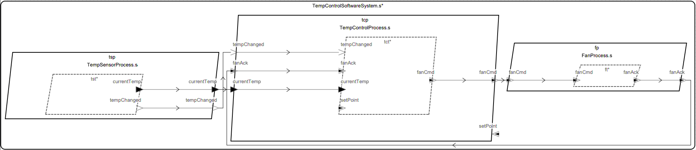

# Temp Control Mixed for C / CAmkES



**NOTE: you need to be in the directory that contains this readme before running any of the commands below**

## Build CAmkES + Sireum Docker Image

1. Install [Docker Desktop](https://www.docker.com/products/docker-desktop/)
2. Build the image via [bin/docker-setup.cmd](bin/docker-setup.cmd)
   ```
   ./bin/docker-setup.cmd
   ```

This adds a ``camkes.sireum`` image to your docker images.

## C Instructions

Rerun codegen targeting Linux
```bash
./bin/run-hamr.cmd Linux
```

Compile/run the transpiled C project natively (requires cmake and a C compiler)

```bash
./hamr/c/bin/compile.cmd
./hamr/c/bin/run.sh
```

Or, compile/run the transpiled C project via docker

```bash
./hamr/slang/bin/transpile.cmd
docker run --rm -it -w /root -v $(pwd):/root/sysml camkes.sireum sh -c \
    "sireum slang run /root/sysml/hamr/c/bin/compile.cmd && /root/sysml/hamr/c/bin/slang-build/Demo"
```

NOTE: remove the ``--rm`` option if you want to reuse the container.  Replace ``sh -c ...`` with ``bash`` if you want to enter an interactive shell.

## CAmkES Instructions


Rerun codegen targeting seL4

```bash
./bin/run-hamr.cmd seL4

# Add the missing stack size configuration entry for the temp control, otherwise
# the temp control app will crash due to it exceeding the default 4K stack size.
./bin/fix-stacksize.cmd
```
Refer [here](TempControlMixedCamkes.sysml#L103) for more information regarding stack size.

Build and simulate the CAmkES image via docker

```bash
docker run --rm -it -w /root -v $(pwd):/root/sysml camkes.sireum sh -c \
    "/root/sysml/hamr/camkes/bin/run-camkes.sh -c /root/camkes -s"
```

